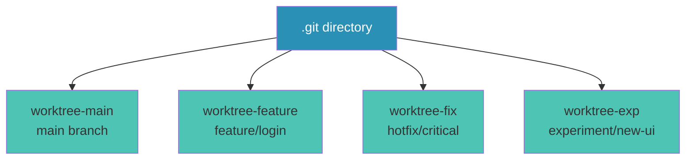

<Title />

---

<AdvancedGitFeatures />

---

<WhatAreGitWorktrees />



---

<TheProblem />

---

<WhatWorktreesSolve />

---

<BasicSyntaxCreate />

---

<BasicSyntaxManage />

---

<CommonCaveats />

---

# Tips & Tricks

<div grid="~ cols-2 gap-4" m="t-4">

<div>

### 🚀 Hot Fixes

```bash
# Critical bug comes in, you're mid-feature
git worktree add ./hotfix -b hotfix/crash
cd ./hotfix
# fix, test, commit, push
cd ./my-project
# Continue feature work uninterrupted
```

### 📝 Code Reviews

```bash
# Review and test PRs locally
git worktree add ./review-pr-123 origin/pr-123
```

### 🏷️ Naming Convention

Use descriptive paths:

```bash
./project-feature-auth
./project-hotfix-login
./project-test-api
```

</div>

<div>

### 🧪 Parallel Testing

```bash
# Run tests in background worktree
cd ./my-project-test
npm test &
cd ./my-project
# Continue coding...
```

### 🔄 CI/CD Workflows

```bash
# CI creates worktree for testing
git worktree add ./build-temp HEAD~1
cd ./build-temp && npm run build
```

### 🧹 Cleanup

```bash
# Clean all finished worktrees
git worktree prune
git worktree list  # Check what remains
```

### An alias for the rescue

```bash
git config --global alias.fix-bare 'config remote.origin.fetch "+refs/heads/*:refs/remotes/origin/*"'
```

</div>

</div>

---

<AICodingSuitability />

---

<RealWorldExample />

---

<Summary />

---

<Questions />

---

<Resources />
