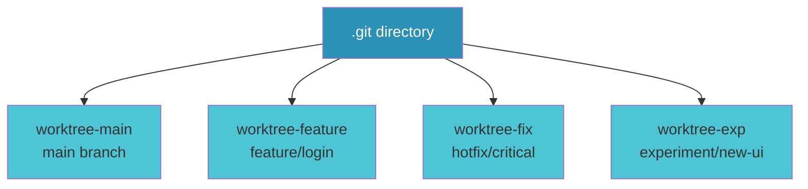

# Git Worktrees

Work on multiple branches simultaneously

<div class="abs-br m-6 text-xl">
  <a href="https://git-scm.com/docs/git-worktree" target="_blank" class="slidev-icon-btn">
    carbon:book
  </a>
</div>

---

# What Are Git Worktrees?

Git worktrees allow you to have **multiple working directories** linked to a **single repository**.

<v-clicks>

- Each worktree has its own working copy
- All worktrees share the same `.git` directory
- No cloning required
- Work on different branches simultaneously

</v-clicks>



---

# The Problem

Traditional Git workflow has pain points:

<div grid="~ cols-2 gap-4" m="t-4">

<div>

### 😫 Context Switching

```bash
# Need to test PR but mid-work on feature
git stash
git checkout pr-branch
# test...
git checkout feature-branch
git stash pop
```

</div>

<div>

### 💾 Disk Waste

```bash
# Need separate env for testing
git clone ../my-project-test
# Now 2x disk usage!
```

</div>

</div>

<div grid="~ cols-2 gap-4" m="t-4">

<div>

### ⏸️ Blocking Operations

Can't run long tests while coding another feature

</div>

<div>

### 🔄 Lost Progress

Forget to stash? Uncommitted changes block branch switch

</div>

</div>

---

# What Worktrees Solve

<v-clicks>

## 🚀 Simultaneous Branches
Work on multiple branches at the same time without stashing

## 💾 Efficient Storage
Share `.git` directory - minimal disk overhead

## ⚡ Zero Context Switching
Each worktree is always ready with your branch

## 🧪 Parallel Work
Code in one worktree while tests run in another

## 🔥 Hot Fixes
Fix urgent bugs without touching your current work

</v-clicks>

---

layout: two-cols
layoutClass: gap-16

---

# Basic Syntax: Create

Create new worktrees from your repository:

```bash
# Create worktree from existing branch
git worktree add ../my-project-feature feature-branch

# Create worktree with new branch
git worktree add ../my-project-experiment -b experiment-branch

# Create worktree at specific commit
git worktree add ../my-project-old HEAD~5

# Create with detached HEAD
git worktree add ../my-project-temp origin/pr-123
```

::right::

<div class="text-sm">

### Parameters

<v-clicks>

- `<path>` - Where to create the worktree
- `<branch>` - Existing branch to checkout
- `-b <new-branch>` - Create new branch
- `--detach` - Detached HEAD mode
- `--checkout` - Default behavior
- `--force` - Force checkout (reset)

</v-clicks>

</div>

```bash {all|2|4|6}
# Example directory structure
my-project/              # original repo
├── .git/
├── my-project-feature/  # worktree 1
├── my-project-fix/      # worktree 2
└── my-project-test/     # worktree 3
```

---

layout: two-cols
layoutClass: gap-16

---

# Basic Syntax: Manage

Commands to manage your worktrees:

```bash
# List all worktrees
git worktree list

# Show worktree details
git worktree list --porcelain

# Move a worktree
git worktree move ../old-path ../new-path

# Remove a worktree
git worktree remove ../my-project-feature

# Clean up stale worktrees
git worktree prune
```

::right::

<div class="text-sm">

### Common Operations

<v-clicks>

**List output shows:**
- Worktree path
- Branch name/commit
- Status (detached, prunable, etc.)

**Remove vs Prune:**
- `remove` - Deletes worktree cleanly
- `prune` - Cleans up stale refs after manual deletion

**Lock/Unlock:**
```bash
git worktree lock ../my-project
git worktree unlock ../my-project
```

</v-clicks>

</div>

---

# Common Caveats

<div grid="~ cols-2 gap-6" m="t-4">

<div>

### ⚠️ Same Branch Limit

Can't checkout the **same branch** in multiple worktrees

```bash
# This will fail if main is already checked out
git worktree add ../wt2 main
# fatal: '../wt2' is already checked out at '.'
```

### ⚠️ Manual Deletion

Don't `rm -rf` worktree directories manually
<span v-click="2">
  → Use `git worktree remove` instead
</span>
<span v-click="3">
  → Or run `git worktree prune` after deletion
</span>

</div>

<div>

### ⚠️ Independent Operations

Each worktree operates independently:
- Rebase/merge conflicts resolved per worktree
- Hooks run in each worktree separately
- Stash is local to each worktree

### ⚠️ Shared Refs

Commits are shared across all worktrees
<span v-click="5">
  → Pushing from one affects all
</span>

</div>

</div>

---

# Tips & Tricks

<div grid="~ cols-2 gap-4" m="t-4">

<div>

### 🚀 Hot Fixes

```bash
# Critical bug comes in, you're mid-feature
git worktree add ../hotfix -b hotfix/crash
cd ../hotfix
# fix, test, commit, push
cd ../my-project
# Continue feature work uninterrupted
```

### 📝 Code Reviews

```bash
# Review and test PRs locally
git worktree add ../review-pr-123 origin/pr-123
```

### 🏷️ Naming Convention

Use descriptive paths:
```bash
../project-feature-auth
../project-hotfix-login
../project-test-api
```

</div>

<div>

### 🧪 Parallel Testing

```bash
# Run tests in background worktree
cd ../my-project-test
npm test &
cd ../my-project
# Continue coding...
```

### 🔄 CI/CD Workflows

```bash
# CI creates worktree for testing
git worktree add ../build-temp HEAD~1
cd ../build-temp && npm run build
```

### 🧹 Cleanup

```bash
# Clean all finished worktrees
git worktree prune
git worktree list  # Check what remains
```

</div>

</div>

---

# AI Coding Suitability

Git worktrees are ideal for AI-assisted development:

<div grid="~ cols-2 gap-6" m="t-4">

<div>

### 🤖 Isolated AI Sessions

Each AI conversation gets its own worktree
- No cross-contamination of changes
- Easy to compare AI suggestions side-by-side
- Rollback is simple (just remove worktree)

### 🔀 Parallel AI Work

Multiple AI agents working simultaneously:
```bash
../project-ai-feature-a    # Claude on feature A
../project-ai-refactor     # Claude on refactor
../project-main            # Your work continues
```

</div>

<div>

### 🧪 Safe Experimentation

```bash
# AI suggests big refactor
git worktree add ../ai-refactor-sandbox -b ai-sandbox
cd ../ai-refactor-sandbox
# Let AI go wild here
# If good: merge to main
# If bad: just delete worktree
```

### 📊 A/B Testing

Compare approaches:
```bash
../project-approach-v1
../project-approach-v2
```

</div>

</div>

---

# Real-World Example

## Scenario: Hot fix while developing feature

<div v-click="1">

### Before (Traditional Way)

```bash
my-project/ $ git status        # Mid-work on feature
my-project/ $ git stash
my-project/ $ git checkout -b hotfix/crash
my-project/ $ # Fix the bug...
my-project/ $ git commit -am "fix: crash"
my-project/ $ git push origin hotfix/crash
my-project/ $ git checkout feature/new-ui
my-project/ $ git stash pop    # Hope nothing conflicts!
```

</div>

<div v-click="2">

### After (With Worktrees)

```bash
my-project/ $ git worktree add ../hotfix -b hotfix/crash
hotfix/ $ # Fix, commit, push...
hotfix/ $ cd ../my-project
my-project/ $ # Never stopped working!
hotfix/ $ git worktree remove ../hotfix  # Cleanup
```

</div>

<div v-click="3" class="mt-4 p-4 bg-green-100 rounded">

**Result:** Zero context switching, zero stashing, zero interruption

</div>

---

layout: center
class: text-center

---

# Summary

<div class="text-left" max-w="600">

## ✅ Key Takeaways

- Worktrees enable simultaneous branch work without stashing
- Share `.git`, separate working directories
- Perfect for hotfixes, code reviews, parallel testing
- Great for AI coding isolation

## ✅ When to Use

- Hot fixes needed while coding feature
- Testing multiple branches/PRs
- Long-running tasks blocking development
- AI wants to experiment safely

## ❌ When NOT to Use

- Simple branch switching (checkout is fine)
- Very short-lived operations
- Single developer, sequential work

</div>

<div class="mt-8 text-sm opacity-75">

[Official Docs](https://git-scm.com/docs/git-worktree) ·
[Atlassian Guide](https://www.atlassian.com/git/tutorials/git-worktree)

</div>

---

layout: center
class: text-center

---

# Questions?

<div class="text-sm opacity-75 mt-8">

Try it out:
```bash
git worktree add ../my-first-worktree -b experiment/test
```

</div>

<PoweredBySlidev mt-10 />
